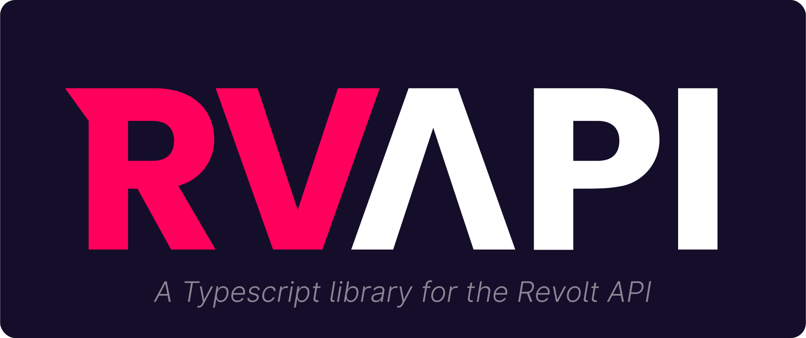

# RVAPI - *A Typescript library for the Revolt API*

## Example

```ts
import { createClient } from "jsr:@jersey/rvapi" // or whatever works

const client = createClient({
    token: "<insert token>"
})

client.bonfire.on("Message", console.log)

client.request("post", "/channels/{channel}/messages", { content: "hello" } )
```
